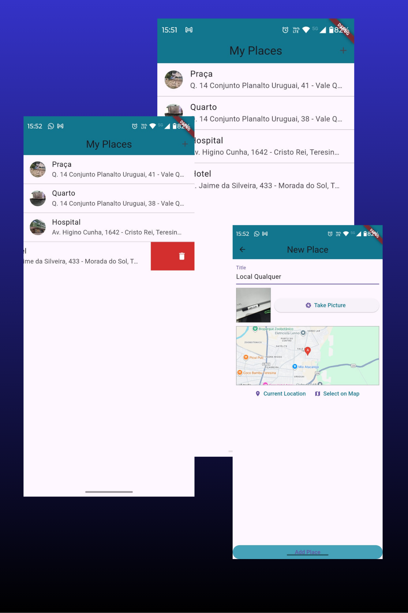

# 🍽️ App de Lugares com Flutter

Este é um projeto desenvolvido em Flutter que registra lugares especiais. Ele permite adicionar título, foto e localização (GPS ou seleção no mapa), exibir a lista com miniaturas e endereços, visualizar no mapa e editar ou remover itens com confirmação.

## 📱 Demonstração

<p align="center">
	
</p>

## 📱 Funcionalidades

- Cadastro com **título, foto e localização** (GPS ou seleção no mapa)
- **Lista persistente** com miniaturas e endereço
- **Detalhe** com visualização no mapa (somente leitura)
- **Edição** de título/localização
- **Swipe‑to‑delete** com confirmação

## 🧠 Principais Aprendizados

Durante o desenvolvimento, foram abordados conceitos essenciais do Flutter e integrações nativas:

### ✅ Uso de Rotas Nomeadas

Rotas centralizadas em `lib/utils/app_routes.dart` para manter o fluxo de navegação limpo:

```dart
class AppRoutes {
	static const String PLACE_FORM = '/place-form';
	static const String PLACE_DETAIL = '/place-detail';
}
```

Navegação entre telas como:

- `PlacesListScreen`
- `PlaceFormScreen`
- `PlaceDetailScreen`

### 🧩 Organização por Telas/Widgets

- `PlacesListScreen`: lista com miniaturas, endereço e swipe‑to‑delete
- `PlaceFormScreen`: formulário com título, foto e localização
- `PlaceDetailScreen`: imagem, endereço e mapa em modo leitura
- Widgets: `LocationInput` e `ImageInput` para mapa e câmera/galeria

### 🗺️ Mapas e Geolocalização

- Seleção de posição com `google_maps_flutter`
- Prévia estática do mapa e **geocodificação reversa** do endereço
- Tratamento de permissões/serviço de localização com feedback via SnackBar

### 💾 Persistência Local

- Banco `sqflite` com tabela `places` (id, title, image, lat, lng, address)
- Migrações defensivas em `onOpen` e `await` em operações para consistência

---

## 📂 Estrutura de Arquivos

```
lib/
├── models/
│   └── place.dart
├── providers/
│   └── great_places.dart
├── screens/
│   ├── places_list_screen.dart
│   ├── place_form_screen.dart
│   ├── place_detail_screen.dart
│   └── place_edit_screen.dart
├── utils/
│   ├── app_routes.dart
│   ├── db_util.dart
│   └── location_util.dart
├── widgets/
│   ├── image_input.dart
│   └── location.input.dart
└── main.dart
```

---

## 🧑‍💻 Tecnologias Usadas

- Flutter, Dart
- Provider (estado)
- sqflite (persistência local)
- google_maps_flutter (mapas)
- location (GPS/permissões)
- image_picker (câmera/galeria)
- http, path_provider, path

---

## 🚀 Como rodar

1. Configure um dispositivo/emulador.
2. Instale dependências e rode o projeto:

```
flutter pub get
flutter run
```

---

## 📌 Observações

Projeto com fins educativos para consolidar:
- Rotas nomeadas e modularização por telas/widgets
- Integração com câmera, localização e mapas
- Persistência local com SQLite + sincronização de estado com Provider
